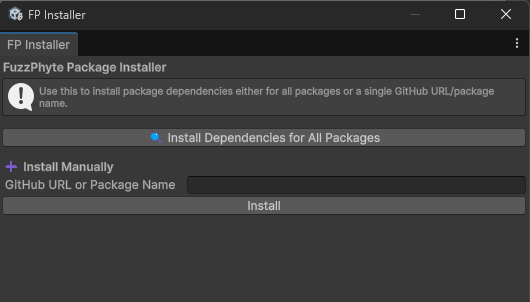

# FuzzPhyte Unity Tools

## Installer

This is a package that helps manage other FuzzPhyte Libraries.

## Setup & Design

This package assumes you're attempting to install other FuzzPhyte libraries and/or want to confirm manual dependency checks - see the FuzzPhyte Menu in the Unity Editor Toolbar for operation.

* FuzzPhyte-->Installer-->Dependency Installer

* If you want to install any existing package without using the package manager, you can put the entire GitHub URL here, for example https://github.com/jshull/FP_Utility.git, will fetch the repository and attempt to install it.
* If you want to install dependencies that are externally hosted and/or you see errors in the console, you need to know the package name and you will just put that assembly information in, for example, "com.fuzzphyte.utility"
  * The underlying FuzzPhyte package has to be using the dependency documentation system and should be updated beyond version 0.2.0

## Dependencies

This relies on Unity.Mathematics and the Unity Editor. Please see the [package.json](./package.json) file for more information and other information if installation fails.

## License Notes

See [LICENSE.md](LICENSE.md) for details

## Contact

* [John Shull](mailto:JShull@fuzzphyte.com)
